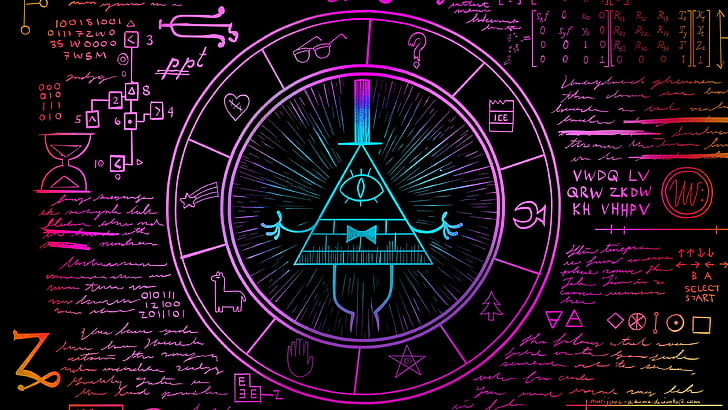

<!-- /code_chunk_output -->

<h1 align="center"> Hi, I'm Omega Troy...👋</h1>

**Junior FullStack Web Developer.**

## about:

I am a young. who is passionate about programming, I like to keep up with new technologies.

I have been studying programming on my own for more than a year and I have learned a lot in this time

**hobbies:** 
> video games,
> 
> watch movies/animes,
> 

https://github.com/OmegaTroy/OmegaTroy/assets/57204144/9d1160f7-82b7-4a01-a435-f60cceb82236

> read mangas,
> 
> edit photos and videos basic level

## skills:

  

  

  

  

  

  

  
  
  
  
  
  
  
